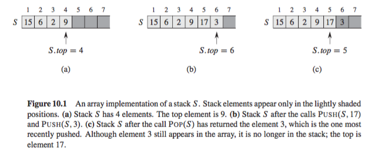

# Stack

In a stack, the element deleted from the set is the one most recently inserted: the stack implements a last-in, first-out, or __LIFO__, policy. 

The INSERT operation on a stack is often called __PUSH__, and the DELETE opera- tion, which does not take an element argument, is often called __POP__.

These names are allusions to physical stacks, such as the spring-loaded stacks of plates used in cafeterias. The order in which plates are popped from the stack is the reverse of the order in which they were pushed onto the stack, since only the top plate is accessible.



As [Figure 10.1](Resources/10.1.png) shows, we can implement a stack of at most n elements with an array S[1 ... S._top_]. The array has an attribute _S.top_ that indexes the most recently inserted element. The stack consists of elements S[1 ... S._top_], where _S[1]_  is the element at the bottom of the stack and S[S._top_] is the element at the top.

When S._top_ = 0, the stack contains no elements and is __empty__. We can test to see whether the stack is empty by query operation _STACK-EMPTY_. If we attempt to pop an empty stack, we say the stack __underflows__, which is normally an error. If S._top_ exceeds n, the stack __overflows__.

### Basic Pseudocode Implementation

```
STACK-EMPTY(S)
    if S.top == 0
        return True
    else return False

PUSH(S,x)
    S.top = S.top + 1
    S[S.top] = x

POP(S)
    if STACK-EMPTY(S)
        error "Underflow"
    else S.top = S.top - 1
        return S[S.top + 1]
```

## Resources

- [What is a Stack?](http://interactivepython.org/runestone/static/pythonds/BasicDS/WhatisaStack.html)
- [The Stack Abstract Data Type](http://interactivepython.org/runestone/static/pythonds/BasicDS/TheStackAbstractDataType.html)

## Code 

- [Python](stack.py)

#### References

- [Introduction to Algorithms 3rd Edition](https://www.amazon.com/Introduction-Algorithms-3rd-MIT-Press/dp/0262033844/ref=sr_1_1?ie=UTF8&qid=1471285317&sr=8-1&keywords=introduction+to+algorithms)
